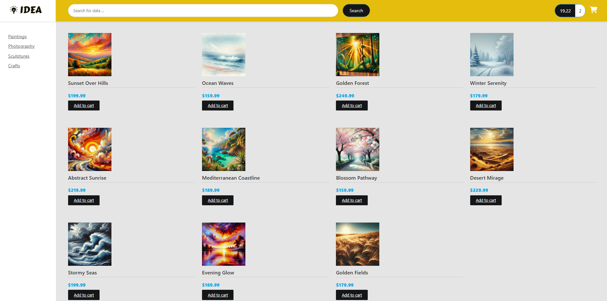

# Full Stack E-Commerce Website with Angular and Spring Boot - ideaShop

## Overview
This E-Commerce website, named "ideaShop", is a full-stack application built with Angular and Java Spring Boot. It includes a wide range of features and functionalities necessary for a modern online store. The project is designed to showcase best practices in building robust and secure web applications using the latest technologies.
Technologies Used:
Backend: Java, Apache Maven, Hibernate, Spring Core, Spring Data, Spring REST, Spring Boot, Spring Security
Frontend: TypeScript, Angular

### Desktop view

**Note**: This is an ongoing process, and further updates and features are being added. (features like Payment-Integration, User-Authentication...)
